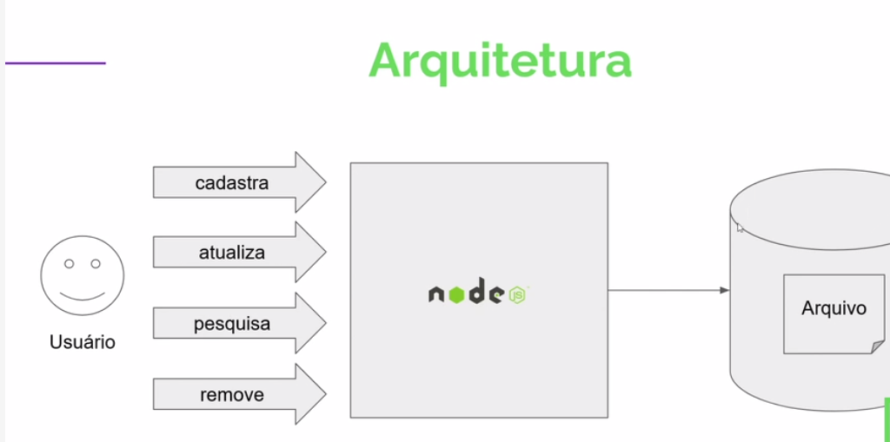

# Pratica de desenvolvimento em JavaScrpt/node.js




Criar um programa em nodejs que recebe 4 comandos do usuario que são eles: 

* Cadastra Usuário
```
localhost:3000/criar-atualizar-usuario?name=san&idade=80&id=1
```

* Atualiza Usuário
```
localhost:3000/criar-atualizar-usuario?name=san&idade=20&id=1
```
* Pesquisa
```
localhost:3000/selecionar-usuario?id=1
```
* Remove
```
localhost:3000/remover-usuario?id=1
```
A base de dados é em formato de arquivo

### Projeto desenvolvido pelo curso Hiring coders [Gama Academy](hhttps://www.gama.academy/) com professor de node.js [Éric Borges](https://www.linkedin.com/in/erikborges/)
